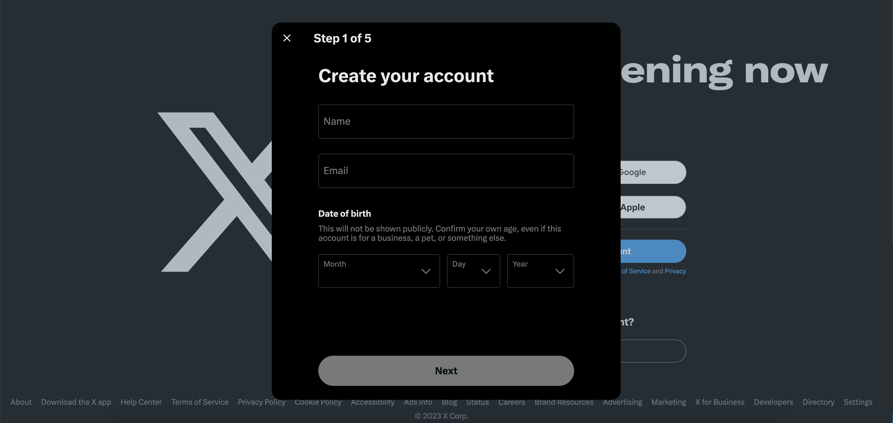
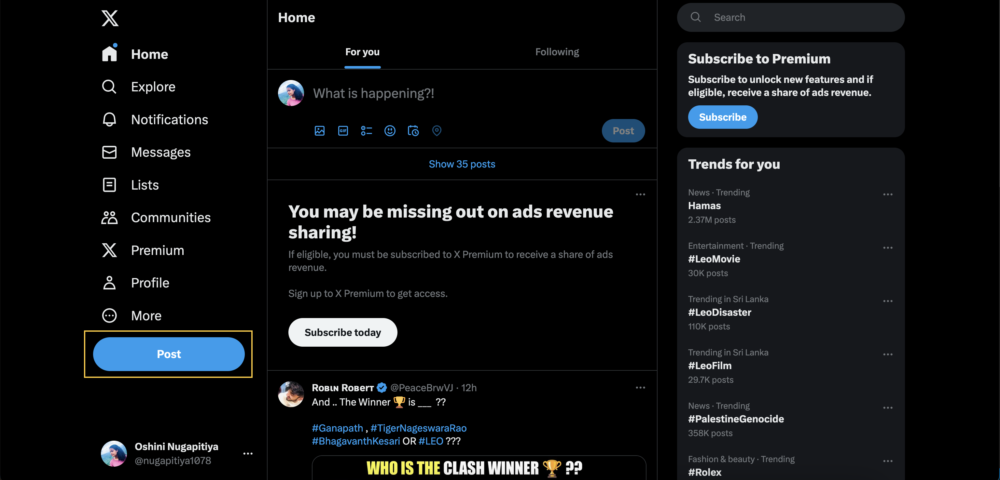
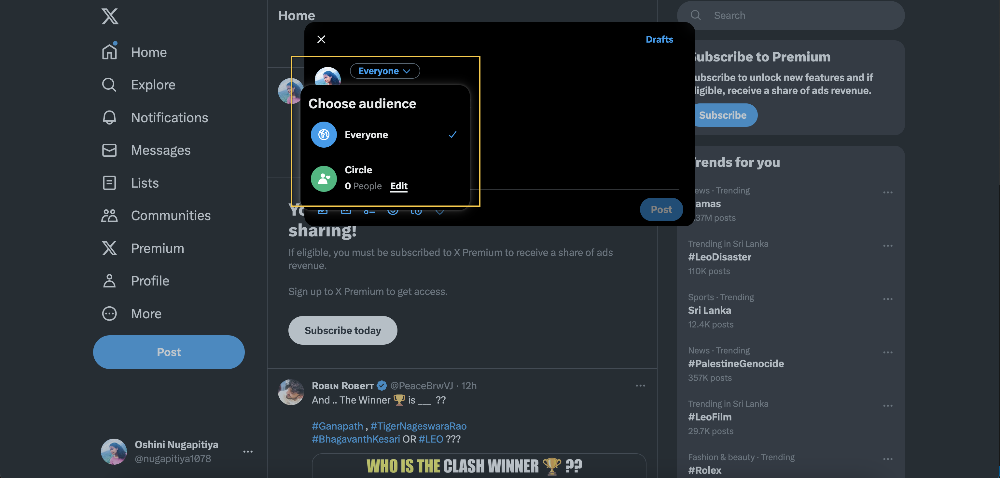
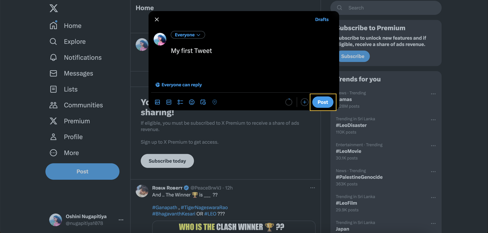

# Getting started on Twitter

## Introduction

Twitter is a social media networking site where you can broadcast your ideas through text, video, photos, and links. This tutorial is a step-by-step guide to help you to get started on Twitter. The tutorial covers the following steps:

- [Step 1: Create a Twitter account](#step-1-create-a-twitter-account)
- [Step 2: Create a post](#step-2-create-a-post)

## Step 1: Create a Twitter account

1. Visit the [Twitter](https://twitter.com/) website.
2. Click **Create account**.
 
3. Enter your name, email, and date of birth in relevant text boxes.
 
4. Click **Next**.
5. Choose a username that represents you.
5. Follow the other instructions on the screen to set up your profile picture and customize your profile.

## Step 2: Create a post

1. Click **Post** on the left navigation bar. 
 
2. Choose the audience you want to share your post from the drop-down menu.
 
3. Type the content you want to share.
4. Click the image icon to attach the images or files you want to post. 
 
5. Click **Post**. 
 